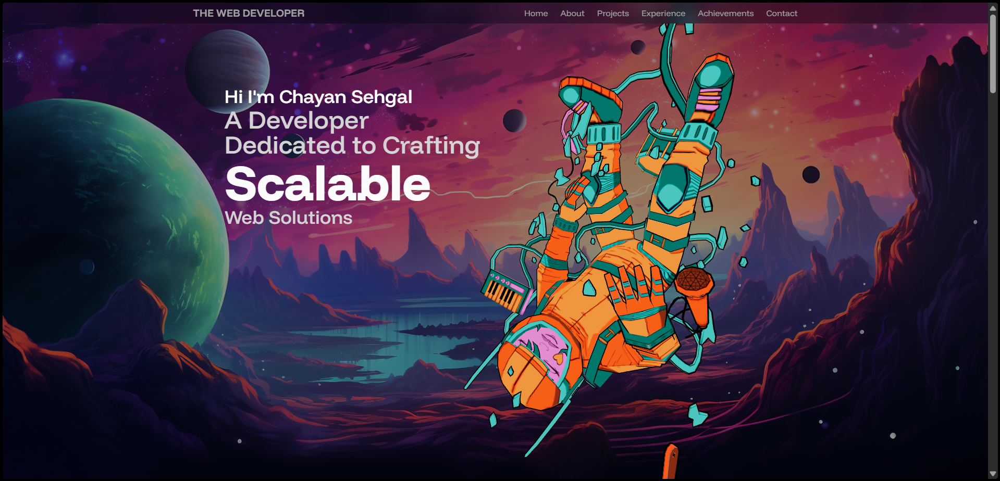

# 🚀 Developer Portfolio

A modern, animated developer portfolio built with React, TailwindCSS, and motion effects — designed to help you stand out and showcase your skills creatively.



---

## 📚 Table of Contents

- [Features](#-features)
- [Tech Stack](#-tech-stack)
- [Project Structure](#-project-structure)
- [Getting Started](#-getting-started)
- [Contact Me](#-contact-me)

---

## ✨ Features

- 🔥 Interactive UI with smooth animations
- ⚡ Smooth transitions and scroll-based animations using **Framer Motion**
- 🎨 Clean, responsive UI with **TailwindCSS**
- 💌 Working contact form using **EmailJS**
- 🚀 Lightning-fast development with **Vite**

---

## 🛠 Tech Stack

| Tech          | Description                         |
| ------------- | ----------------------------------- |
| React         | Front-end JavaScript library        |
| Vite          | Fast bundler and dev environment    |
| TailwindCSS   | Utility-first CSS framework         |
| Framer Motion | Animation library for React         |
| EmailJS       | Form handling and email integration |

---

## 📁 Project Structure

```bash
├── public/
│   ├── assets/             # Images, textures, icons
│   └── models/             # 3D models
├── src/
│   ├── components/         # Reusable components
│   ├── constants/          # Reusable data
│   ├── sections/           # Portfolio sections (Hero, About, etc.)
│   ├── App.jsx             # Main app file
│   ├── index.css           # Tailwind CSS
│   └── main.jsx            # Entry point
├── tailwind.config.js
└── vite.config.js
```

---

## 🚀 Getting Started

### 1. Clone the Repository

```bash
git clone https://github.com/Chayansehgalll/portfolio.git
cd portfolio
```

### 2. Install Dependencies

```bash
npm i
```

### 3. Run the Development Server

```bash
npm run dev
```

The app will be available at http://localhost:5173.

---

## 📬 To Connect With Me

[](https://www.instagram.com/chayan.sehgal?igsh=cjdldWNucTI0NWht)
[](https://www.linkedin.com/in/chayan-sehgal/)
[](https://github.com/Chayansehgalll)

---

## ⭐ Like This Project?

Star the repo if you found it useful!
